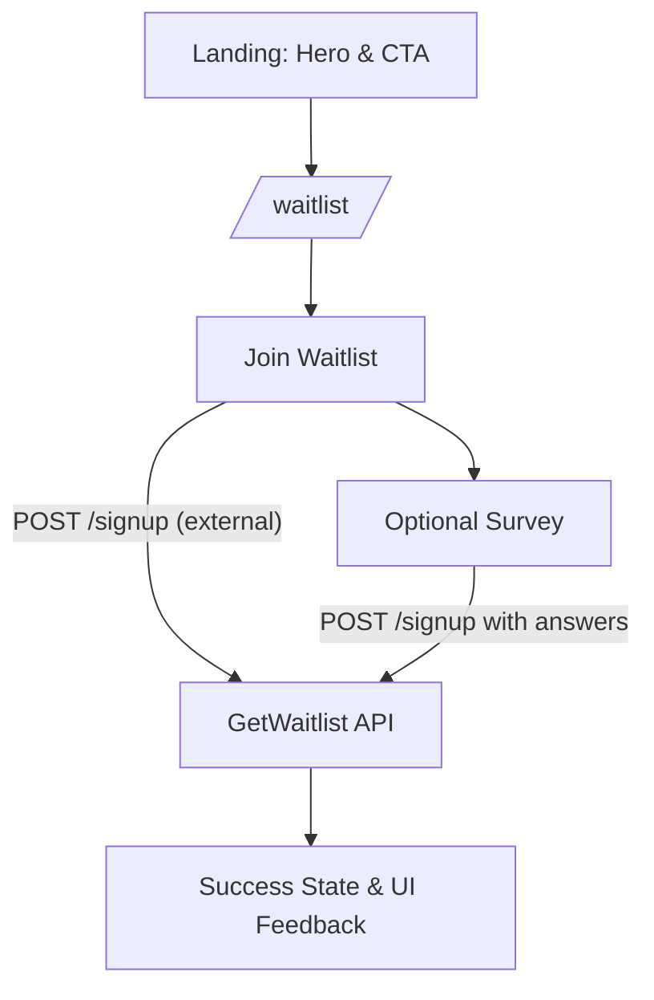

# SaveApp Landing

A modern, static-exported Next.js landing site for SaveApp with a waitlist flow and survey, styled with Tailwind CSS and Radix UI components. Built for collecting early-access signups and insights ahead of a private beta.

## Badges

     

## Table of Contents

- [Installation / Requirements](#installation--requirements)
- [Usage](#usage)
- [Configuration](#configuration)
- [Contributing](#contributing)
- [Tests](#tests)
- [Roadmap](#roadmap-optional)
- [Authors & Acknowledgments](#authors--acknowledgments)
- [License](#license)

## Installation / Requirements

This repository is a Next.js 15 app configured for static export. Main technologies:

- Next.js 15, React 19, TypeScript 5
- Tailwind CSS 3.4 (with tailwindcss-animate)
- Radix UI (accordion, dialog, dropdown, etc.)
- Lucide React (icons)

Node and package manager

- Node.js >= 18.18 recommended
- pnpm (preferred, lockfile present) or npm

Install and run (pnpm)

```bash
# Install dependencies
pnpm install

# Start dev server
pnpm dev
# Local: http://localhost:3000/

# Build (static export to ./out)
pnpm build

# Preview production build (serve static out/)
# Use any static server; e.g.:
npx serve@latest out --single --listen 3000
# Local: http://localhost:3000/
```

Install and run (npm)

```bash
npm install
npm run dev
npm run build
npx serve@latest out --single --listen 3000
```

Relevant scripts (from package.json)

- dev: next dev
- build: next build (with output: 'export' => generates ./out)
- start: next start (not used for static export; prefer serving ./out)

Key runtime paths

- / — main landing page (hero, benefits, how-it-works, banks, FAQ, footer)
- /waitlist — waitlist page with email capture and optional survey

## Usage

Run locally and explore

1. Start the dev server with pnpm dev (or npm run dev).
2. Visit http://localhost:3000/ and scroll through the sections.
3. Click the primary CTA to open the dedicated waitlist flow at /waitlist.

Programmatic example (client-side helpers)

```ts
// lib/utils/waitlist-service.ts
import {
  joinWaitlist,
  submitWaitlistSurvey,
  getWaitlistQuestions,
  getWaitlistSignup,
} from "@/lib/utils/waitlist-service";

// Join the waitlist
await joinWaitlist("user@example.com");

// Check if email is already signed up (returns boolean)
const isSignedUp = await getWaitlistSignup("user@example.com");

// Fetch survey questions and submit answers
const questions = await getWaitlistQuestions();
await submitWaitlistSurvey("user@example.com", [
  { question_id: questions[0]?.id, answer: "Ualá, Santander" },
  { question_id: questions[1]?.id, answer: "Sí" },
  { question_id: questions[2]?.id, answer: "iOS" },
]);
```

Visual overview



## Configuration

Environment variables

- None required at this time. External requests are made directly to GetWaitlist API without secrets.

Waitlist service configuration

- File: lib/utils/waitlist-service.ts
  - WAITLIST_API_URL: "https://api.getwaitlist.com/api/v1/signup"
  - WAITLIST_ID: 29910

If you need to adjust these values, consider moving them to environment variables (e.g., NEXT_PUBLIC_WAITLIST_ID) and never commit secrets. Example approach:

```bash
# .env.local (not committed)
NEXT_PUBLIC_WAITLIST_ID=29910
NEXT_PUBLIC_WAITLIST_API_URL=https://api.getwaitlist.com/api/v1/signup
```

Then use process.env.NEXT*PUBLIC*\* in the client code.

Static export

- next.config.mjs is set to output: 'export' and images: { unoptimized: true }.
- Build produces a static site in ./out suitable for static hosting.

Theming and localization

- A minimal ThemeProvider stores theme in localStorage ("saveapp-theme").
- UI strings provided in lib/translations.ts (Spanish currently).

Security note

- Do not commit secrets or API keys. This project currently uses only public endpoints for waitlist operations.

## Contributing

This repository is currently intended for internal development of the SaveApp team.

- Branch naming: feature/..., fix/..., chore/...
- Open a PR targeting main and request review.
- Ensure the site builds and renders locally prior to review.

If a CONTRIBUTING.md file is added in the future, it will be referenced here.

## Tests

There is no formal test suite configured yet (no Jest/Vitest/Playwright present).

- Recommended next steps: Add component tests for critical flows (waitlist join and survey), and E2E smoke checks.
- Until then, manual verification: pnpm build and serve ./out, then test / and /waitlist flows.

## Authors & Acknowledgments

- SaveApp Team

Built with and inspired by:

- Next.js, React, TypeScript
- Tailwind CSS, tailwindcss-animate
- Radix UI primitives
- Lucide React icons

See package.json for the complete list of dependencies used.

## License

Proprietary – Not for public distribution.

- No LICENSE file is present in this repository. All rights reserved.
